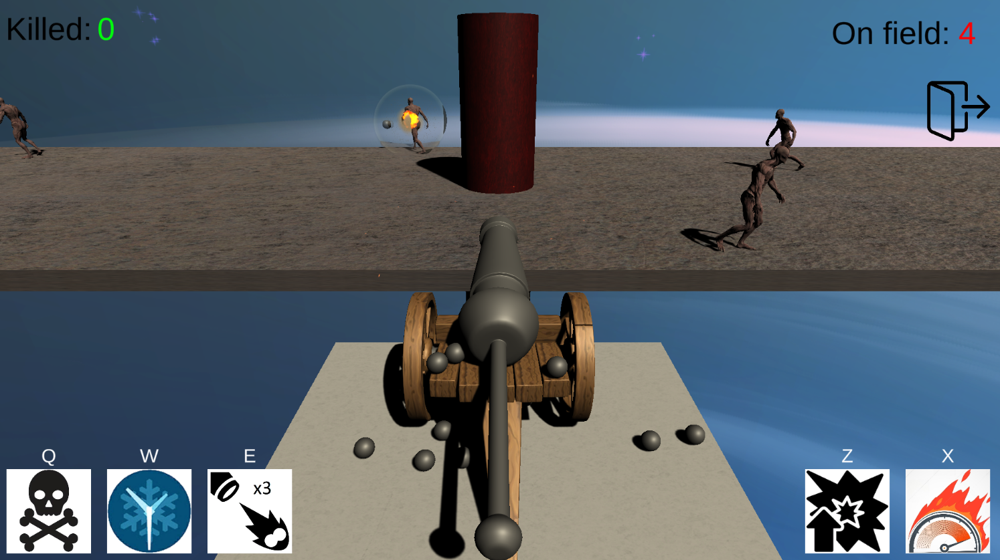

# Time is Monsters

This is a single-player game where the main goal is to kill as many monsters as possible.

The player has a cannon that deals damage to the monsters. Initially, the enemies have 100 HP, and one shot from the cannon deals 40 damage.

However, as the game progresses, the difficulty increases:
- The enemies gain more HP.
- Their movement speed increases.
- The spawn time for new monsters decreases.

The player has access to 2 skills and 2 upgrades:
- Skill #1: Kills all monsters on the field.
- Skill #2: Freezes monster spawn for 10 seconds.
- Upgrade #1: Increases the cannon's damage.
- Upgrade #2: Increases the cannon's rate of fire.

If the number of enemies on the field reaches 10, the game ends.

The earned score can be added to the leaderboard (top 10 high scores).

Game Engine: Unity

Platforms: Windows

